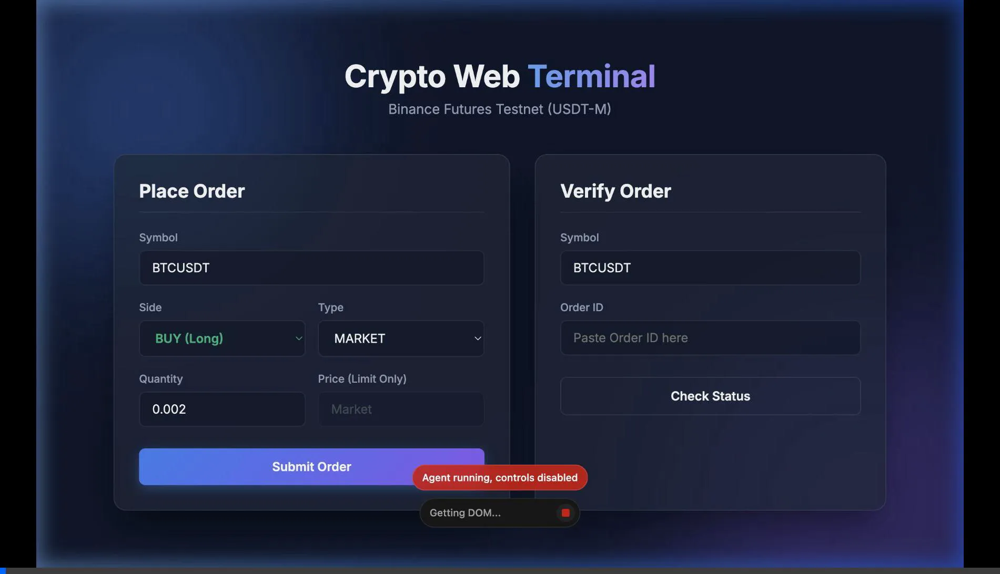
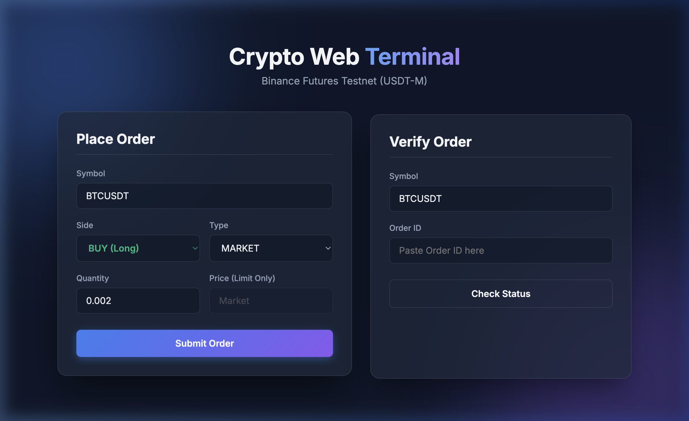
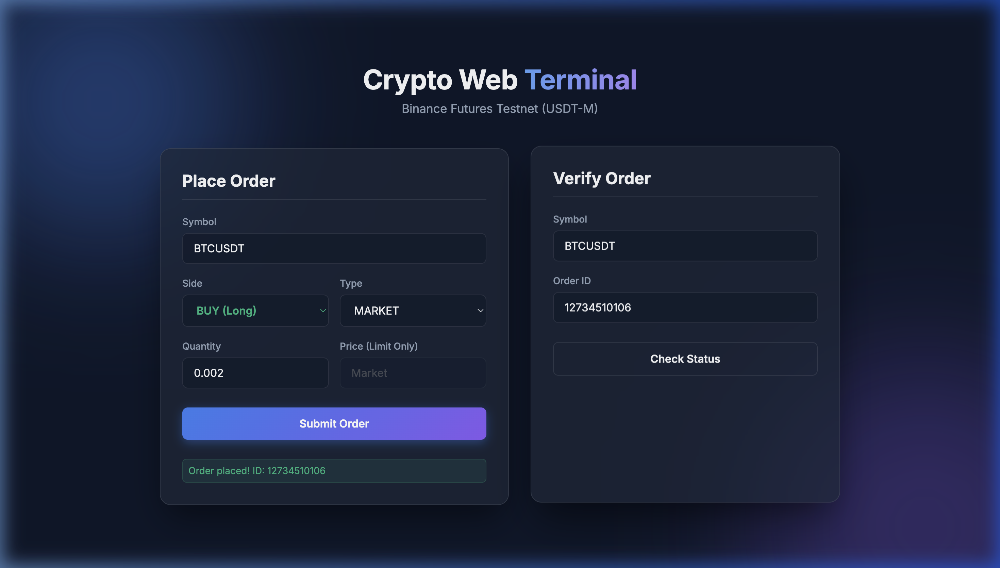

# Binance Futures Testnet Trading Bot CLI

Small CLI and beautiful Web Application I put together to place market and limit orders on **Binance Futures Testnet** (USDT-M) without touching the main Binance website. It includes a custom FastAPI backend serving a modern Glassmorphism UI, or you can use it directly as a CLI tool. Testnet only — no mainnet.

## What’s in the repo

```
trading_bot/
├── bot/
│   ├── __init__.py
│   ├── client.py         # API client, signing, .env loading
│   ├── orders.py         # place order + market notional check
│   ├── validators.py     # symbol, qty, price checks
│   └── logging_config.py # logs to logs/trading.log
├── cli.py                # argparse + place/verify flow
├── web/
│   ├── server.py         # FastAPI backend
│   └── static/           # HTML/CSS/JS frontend
├── requirements.txt
└── README.md
```

You need **Python 3.x** and a **Futures Testnet** API key from Binance (not mainnet, not spot).

## Quick start

From the directory that *contains* `trading_bot` (project root):

```bash
python3 -m venv venv
source venv/bin/activate   # or venv\Scripts\activate on Windows
pip install -r trading_bot/requirements.txt
```

Then get your keys from [testnet.binancefuture.com](https://testnet.binancefuture.com) (log in, create an API key). Easiest is to use a `.env` in the project root:

```bash
cp .env.example .env
# edit .env and paste your key + secret
```

`.env` should look like:

```
BINANCE_FUTURES_API_KEY=your_key_here
BINANCE_FUTURES_API_SECRET=your_secret_here
```

Don’t commit `.env` — it’s in `.gitignore`. If you prefer, you can `export` those two vars in your shell instead; the client checks env first, then `.env`.

## Running the Web Interface

The easiest way to use the bot is via the new beautiful Web Interface!

1. Start the FastAPI server (from the project root):
```bash
python -m uvicorn web.server:app --port 8000
```
2. Open your browser and navigate to `http://127.0.0.1:8000`.

### Demo & Screenshots





## Running the CLI

Still from the project root:

**Place orders**

```bash
# Market buy (size must be ≥ 100 USDT notional — e.g. 0.002 BTC is fine)
python -m trading_bot.cli --symbol BTCUSDT --side BUY --order_type MARKET --quantity 0.002

# Limit sell (price required; keep it within Binance’s allowed range or you’ll get -4024)
python -m trading_bot.cli --symbol BTCUSDT --side SELL --order_type LIMIT --quantity 0.002 --price 67000
```

**Check that an order really hit the exchange**

After placing, you get an `orderId` in the output. To double-check:

```bash
python -m trading_bot.cli --symbol BTCUSDT --order_id 12655342897
```

That hits the API and prints whatever Binance has for that order. You can also open the testnet site → Orders / Order History and find the same ID there.

## Args at a glance

| Arg           | When        | Meaning |
|---------------|-------------|--------|
| `--symbol`    | always     | Pair, e.g. BTCUSDT |
| `--side`      | when placing | BUY or SELL |
| `--order_type`| when placing | MARKET or LIMIT |
| `--quantity`  | when placing | Size (must be &gt; 0) |
| `--price`     | LIMIT only  | Limit price |
| `--order_id`  | when verifying | Order ID from a previous place |

## Deployment

To deploy this bot so it runs 24/7 without keeping your computer on, you have a few options:

### 1. Cloud Providers (Render, Railway, Heroku)
You can easily deploy the Web Interface to PaaS providers.
- **Start Command**: `uvicorn web.server:app --host 0.0.0.0 --port $PORT`
- **Environment Variables**: Add `BINANCE_FUTURES_API_KEY` and `BINANCE_FUTURES_API_SECRET` in your provider's dashboard (do not commit your `.env` file).

### 2. Docker
A `Dockerfile` is included in the repository. You can build and run it anywhere Docker is supported (like a DigitalOcean Droplet or AWS EC2).
```bash
# Build the image
docker build -t binance-testnet-bot .

# Run the container (make sure your .env exists)
docker run -d -p 8000:8000 --env-file .env binance-testnet-bot
```

## Things that bite

- **Min notional 100 USDT**  
  Binance will reject tiny orders. For BTC, 0.002 is safe; 0.001 often isn’t. The script checks this for market orders (using current price) and for limit orders (using your price).

- **Limit price band**  
  For limits, Binance only allows prices in a band around the current price. If you get “Limit price can't be lower/higher than X”, pick a price inside that range (the error message tells you the bound).

- **Testnet liquidity**  
  Sometimes market orders sit in NEW for a bit on testnet. We use `newOrderRespType=RESULT` and a short poll so you usually see FILLED and avgPrice; if the book is empty, the order might stay unfilled — that’s testnet, not a bug.

- **Credentials**  
  Only from env or `.env`. No config file or CLI flags for the key/secret.

Logs go to `logs/trading.log` (created in the current working directory). Errors (validation, API, network) are printed to stderr and the process exits with 1.

## License

Use it, change it, no warranty. Keep your keys out of the repo.
